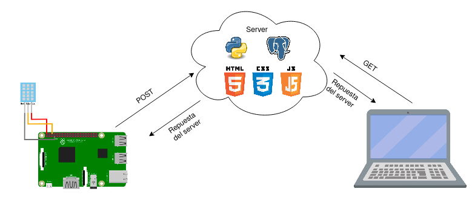
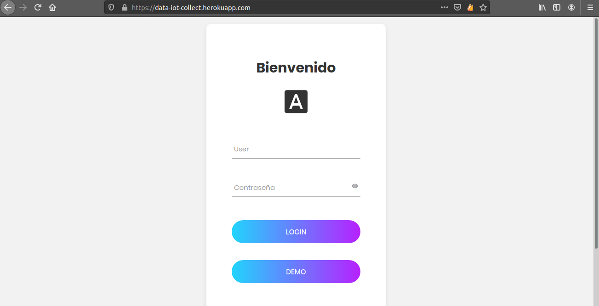

# data_uploader_iot
Proyecto en donde con una raspberry pi o placa similar se puede hacer la subida de datos de sensores y visualizacion en una app tipo dashboard. (Screenshoots mas abajo)

## Descripcion :scroll:
Basicamente es un sistema que consta en dos partes, una es la subida de datos mediante una 
Raspberry Pi y cualquier tipo de sensor(en este caso de temperatura) y la segunda parte es el
servidor en donde se pueden almacenar y visualizar los datos 

### Funcionamiento de la subida de datos 
Para la subida de datos, en este caso como ejemplo usamos un sensor DHT11, la conexion fisica es: <br>
   <strong><p style='margin: 5%'> Pines DHT-------------Pines RPI  </p> </strong>
   <p style='margin:5%'>     GND   -----------   GND  </p>  
   <p style='margin:5%'>    VCC   -----------   5V    </p> 
   <p style='margin:5%'>        DATA  -----------  GPIO23 (puede ser otro gpio pero debe especificarse) </p> 
Si se utiliza otro puerto para el data se debe de cambiar la siguiente linea,      <br>
ademas si el sensor es DHT22, se cambia tambien el primer parametro por dht.DHT22  <br>

```
humi, temp = dht.read_retry(dht.DHT11, 23) # 23 se refiere al GPIO de la RPI

```

Se necesita una conexion a internet, entonces al correr el script, este va a postear de manera 
indefinida cada cierto tiempo(especificado en el sleep(tiempo) en segundos), ademas para que el 
servidor pueda recibir estos datos debe de tener el token que se genera del lado del server

```
myobj = { 
                'token':token_str,
                'temp': str(temp),  
                'fecha': str(datetime.now()),
                'lat': -28.339450 , 
                'long':  -58.551921,
                'codigo': 'NUW1'
        }
```
en donde <strong> token_str </strong> es una variable importada del archivo token_disp.py. 
En este caso solo se envia  la temperatura, pero se podria enviar muchos datos mas, ademas 
la ubicacion es estatica, se podria ver algun modulo GPS para obtener la ubicacion si es que 
el dispositivo cambia de ubicacion por ejemplo. 
### Funcionamiento del servidor 
Basicamente el servidor posee un endpoint en donde recibe los datos por el metodo POST, entonces 
primeramente verifica si es que esta dentro de los tokens en la DB para poder aceptar el dato 
y guardar en la base de datos, el endpoint encargado de esto es el <strong>/data </strong>.


### Esquema 



### Algunos Screenshoots :computer:




