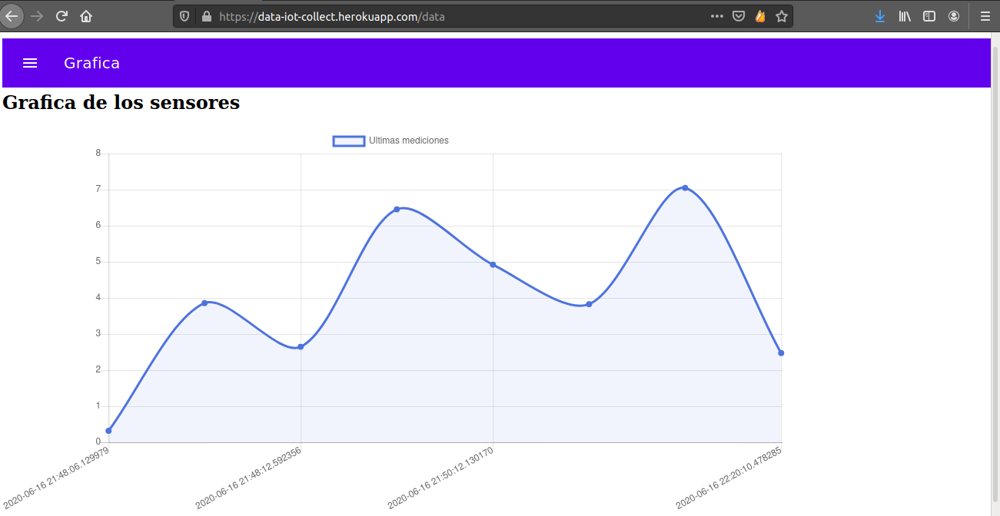
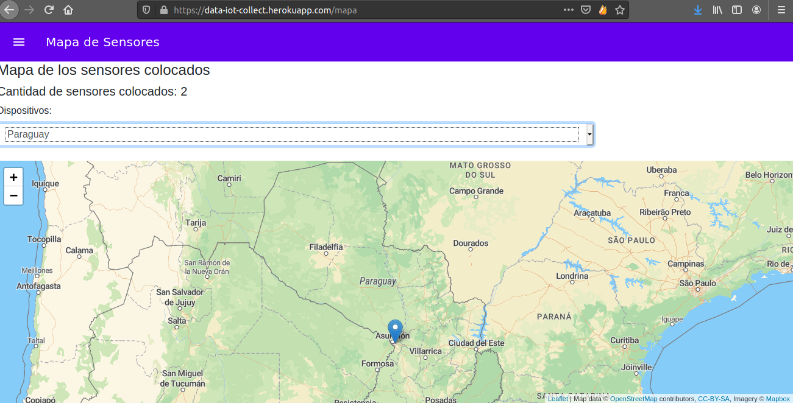

# data_uploader_iot
Proyecto en donde con una raspberry pi o placa similar se puede hacer la subida de datos de sensores y visualizacion en una app tipo dashboard.

## Descripcion :scroll:
Basicamente es un sistema que consta en dos partes, una es la subida de datos mediante una 
Raspberry Pi y cualquier tipo de sensor(en este caso de temperatura) y la segunda parte es el
servidor en donde se pueden almacenar y visualizar los datos 

### Funcionamiento de la subida de datos 
Para la subida de datos, en este caso como ejemplo usamos un sensor DHT11, la conexion fisica es: 
        Pines DHT           Pines RPI
           GND   -----------   GND 
           VCC   -----------   5V
           DATA  -----------  GPIO23 (puede ser otro gpio pero debe especificarse)
Si se utiliza otro puerto para el data se debe de cambiar la siguiente linea, 
ademas si el sensor es DHT22, se cambia tambien el primer parametro por dht.DHT22
```
humi, temp = dht.read_retry(dht.DHT11, 23) # 23 se refiere al GPIO, 

```


### Esquema 


### Algunos Screenshoots :computer:




